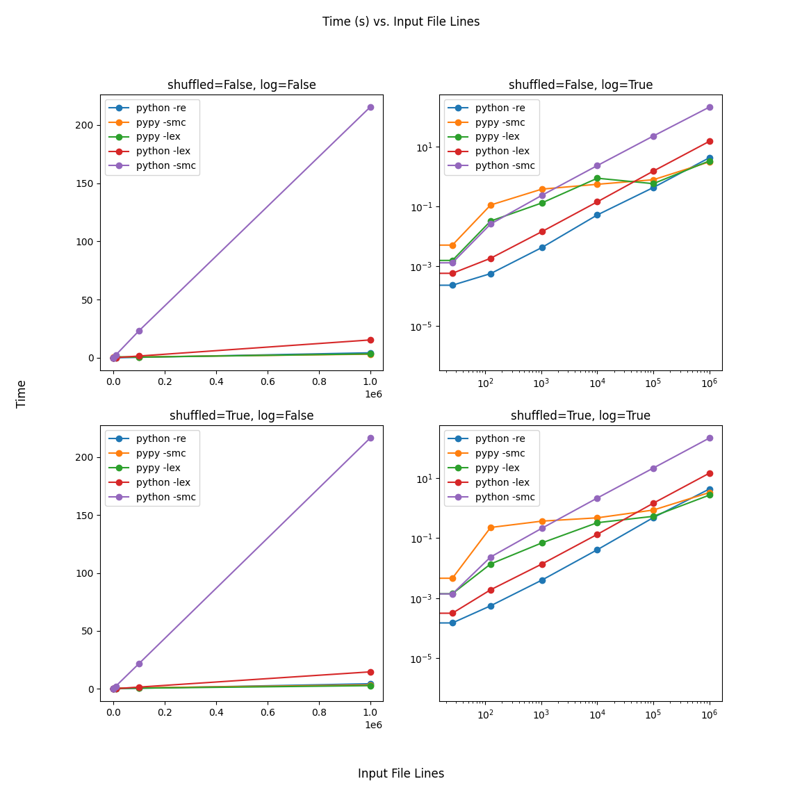

# mephi_automata_theory

This is my solitions to labs in automata theory 

## soft_1

Extract information from the text using three methods and compare them (using lex, regex and state machine compiler)

## soft_2 

Here I make a regex library, that gives most of the popular features while using updated DFA under the hood. Nice stuff!

## soft_3

This a compiled programming language that have built-in maze logic, so it can generate and solve mazes. That's why it's probably a domain specific language. Still prettry cool!

## other

The rest are simple bonus tasks, not much of interest.
