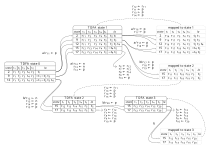

# Добавление групп захвата в ДКА


## Проблема

Чтобы добавить группы захвата в ДКА нужно решить две проблемы:

1. Регулярные выражения позволяют неоднозначность интерпретации.  
    Например регулярное выражение `a*(a|b)b*` с входной строкой `"aabb"`, можно интерпретировать   
    как `a*` отвечает за `aa`, `(a|b)` за следующую `b` и `b*` за последуюю `b`  
    или `a*` отвечает за `a`, `(a|b)` за следующую `a` и `b*` за последние `bb`.  
    Ещё пример - `a?a*a+`, какая из `a?`, `a*`, `a+` будет отвечать за какую часть строки?

2. Способ сохранения индексов начала и конца для групп захвата.  
    Чтобы получить саму захваченную группу после обработки надо знать  
    индексы начала и конца группы внутри строки.  
    А значит схранить из куда-то во время обработки строки,  
    соответвественно добавить поддержку этого в ДКА.

## Разрешение неоднозначностей

В обычных ДКА неоднозначности не являются проблемой, но если мы хотим захватить только часть регулярного выражения, мы должны определить, какие части регулярного выражения отвечают за какие части обрабатываемой строки.

Так как существует много путей определить эту неоднозначность,
я буду рассматривать тольк однин "метод разрешения неоднозначностей" -
"leftmost greedy" по умолчанию - каждая часть регулярного выраджения будет пытаться захватить как можно большее количество символов, и только когда невозможно захватить больше, происходит переход к следующей части.
Например в `a*(a|b)b*` и `"aabb"`, `a*` захватит `aa`, `(a|b)` заватит `b`, и `b*` - `b`.
Но в целом, с представленным здесь подходом можно добиться любого варианта разрешения неоднозначности, известного во время преобразования в ДКА.

Здесь описывается способ разрешения неоднозначности, работающий при преобразовании РВ в НКА и НКА в ДКА.
Чтобы сделать НКА однозначным, вводим приоритет для каждого эпсилон-перехода. Соотвественно при преобразовании РВ в НКА надо использовать наш метод разрешения неоднозначности, чтобы расставить эти приоритеты.

Вот пример НКА с приоритетами для `a*(a|b)b*`, построенного с помощью Построения Томпсона:


В случае НКа удобно думать о неоднозначностях, как о разных путях, которые могут привести к поглощению одной и той же строки

Здесь, например для строки `"aabb"` есть два таких различных путя:  

-   ```
    7 ~> 6 ~> 5 ~> 6 ~> 5 ~> 4 ~> 3 ~> 2 ~> 1 ~> 0
           a         a         b         b
    ```

-   ```
    7 ~> 6 ~> 5 ~> 4 ~> 3 ~> 2 ~> 1 ~> 2 ~> 1 ~> 0
           a         a         b         b
    ```

Можно заметить, чтобы получить первый путь, надо при возможности следовать по эпсилон-переходам  
с самым высоким приоритетом `(1 выше 2, 2 выше 3, ...)` и доступным перезодам по символам.

Когда же второй путь раньше пошёл по переходу `5 ~> 4`, хотя ещё можно было пойти по `5 ~> 6`, имея незахваченный `a`.

Пока мы не добавили возможность захватывать индексы, этот порядок не влияет на создание ДКА.

## Сохранение индексов

Задачу сохраниения начала и конца группы можно преобразовать в более глобальную задачу сохранения индекса в любом заранее "помеченном" месте. Из этого происходят три расширения - РВ с метками, НКА и ДКА с метками (с помеченными переходами) - Помеченные РВ (ПРВ), Помеченные НКА (ПНКА) и Помеченные ДКА (ПДКА).  

В РВ добавляются метки.  
Например, если `(!...)` обозначает захватывающую группу, то `(!a)*(a|b(!))(!b*)` может быть превращено в ПРВ $(t_1at_2)^*(a|bt_3)t_4b^*t_5$  
Здесь, $t_x$ будет означать метку, которая будет сохранять текущей индекс в момент нахождения.

В НКА, к эпсилон-переходам добавляется возможность совпасть с меткой, или явно несовпасть (второе не обязательно, но может быть полезной информацией). На один эпсилон-переход можно совершить только одно не-/совпадение.

ПНКА для ПРВ $(a|bt_3)$ будет выглядеть следующим образом:


Здесь переходы `4 ~> 1`, `2 ~> 0` имеют метки совпадения с `1`, несовпадения с `1`

Соотвественно ПНКА для ПРВ $(t_1at_2)^*t_3(a|bt_4)t_5b^*$ будет выглядеть следующим образом:


ДКА удобно тем, что все операции, которе могут быть выполнены заранее, запечатаны в структуру автомата, тем самым делая его выполнение менее ресурсозатратным.
Было бы удобно таким же образом запечатать всё возможные индексы меток в процессе построения ПДКА, но это приведёт к тому, что количество состояний будет бесконечно расти во время построения.
Простой пример: $(t_1at_2)^*$, здесь, чтобы захватить именно правильные индексы нужно построить бесконечный путь из состояний, где в каждом переходе будет находиться индекс, больше на 1, чем в предыдущем.

Проблемой является то, что мы пытается сохранить сами конкретные индексы, но если мы переключимся на сохранение одного из двух значений `p` - текущий индекс или `n` - явное несовпадение, то таким образом В ПДКА мы оставим только статическую часть, позволяя работить с ним, почти как с обычным ДКА, в то время как динамическую часть работы с конкретной строкой с конкретными индексами будет заниматься среда выполнения.

Само построение ПДКА работает по класическому алгоритму построения подмножеств Рабина-Скотта(powerset construction), где сами подмножества составляются эпсилон-замыканиями, из предыдущих состояний, прошедших через символьные переходы.

Но при добавлении меток возникают некие трудности, надо не только следить на набором состояний и замыкании, но и через какие не-/совпадения с какими метками мы проходим, чтобы достичь следующего состояния. Соответственно, когда мы пытаемся понять, совпадают ли два подмножества, мы должны также учитывать такблицу не-/совпадений.

Также возникает ещё одна проблема - набор состояний одинаковый, а таблицы не-/совпадения меток разные. В таком случае, если мы можем найти биективное отображение одной таблицы на другую, то состояния одинаковы.

Чтобы оптимизировать процесс, и не создавать огромное количество состояний, мы делаем две важные оптимизации:

1. разделяем таблицу, где мы следим за метками на две части:
    одна часть - метки, которые мы обработали до перехода по символу,
    другая - метки, которые мы обрабатываем на текущем эпсилон-пути. В таким случае нам надо сравнить в первую очередь вторую таблицу, с новыми метками. А для первой таблицы, если она не совпадает, можно попробовать построить биективного отображение.
2. при создании эпсилон-замыкания, мы не будет сохранять те состояния,
    которые не имеют исходящих переходов по символам.
    Это позволяет строить почти минимальные ДКА (ДКА не будут минимальными, если в самом РВ будут лишние повторения)

Хорошо, мы получили набор состояний, с соответствующей им информацией о метках. Как это можно превратить в операции на переходах ПДКА?
Во первых, надо ввести "регистр" - хранилище индексов, с ними и будут происходить операции на переходах в ПДКА. Достаточно всего три типа операций:

1. Операция сохранения `p`/`n` в какой-то регистр
2. Операция копирования значения одного регистра в другой
3. Объединение 1 и 2 - Операция копирования + сохранения

Алгоритм получения операция над регистрами таков: надо исполнить те не-/совпадения,
которые храняться во второй таблице, и записать их в свободный регистр, проще всего просто добавить новый регистр, он точно будет свободным, и от него не будут зависеть другие регистры, но можно также переиспользовать регистры, если в них сохраняется одно и то же значение, при переходе из одного и того же состояние ПДКА.  
Если переход в существующее состояние, и оно биективно отображено, это отбражение дополняет операции над регистрами, приходящие из второй таблицы.

Вот пример с преобразованием ранее рассмотренного ПНКА в ПДКА:



После чего получается такой ПДКА:


